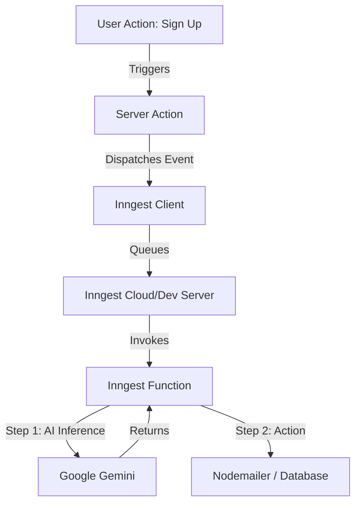

# Inngest & Google AI Integration Guide

This document provides a comprehensive overview of how **Inngest** and **Google AI (Gemini)** are integrated into the Stock Trading Platform to handle background jobs, event-driven workflows, and AI-powered features.

---

## 🏗️ Architecture Overview

The system uses an event-driven architecture where specific user actions (like signing up) trigger background processes.



---

## 🛠️ Configuration

### 1. Inngest Client
The client is initialized in `lib/inngest/client.ts`. It is configured to use Google Gemini as the AI provider.

```typescript
export const inngest = new Inngest({
  id: "Stock Trading Platform",
  ai: { gemini: { key: process.env.GEMINI_API_KEY! } },
});
```

### 2. Environment Variables
Ensure these are set in your `.env` file:
- `GEMINI_API_KEY`: Your Google AI Studio API key.
- `INNGEST_EVENT_KEY`: (Production) Key for sending events to Inngest.
- `INNGEST_SIGNING_KEY`: (Production) Key for verifying Inngest requests.

---

## 🤖 Google AI Integration (Inngest AI)

We use **Inngest AI** to run LLM inferences directly within our background functions. This allows for reliable, retriable AI steps.

### How it works
In `lib/inngest/functions.ts`, we use `step.ai.infer` to call Gemini.

```typescript
const response = await step.ai.infer("generate-welcome-intro", {
  model: step.ai.models.gemini({ model: "gemini-2.0-flash-lite" }),
  body: {
    contents: [{ role: "user", parts: [{ text: prompt }] }],
  },
});
```

### Why use `step.ai.infer`?
1.  **Retries**: If the AI call fails (rate limits, network issues), Inngest automatically retries only that specific step.
2.  **State Management**: The AI response is cached. If the function restarts, it doesn't re-run the expensive AI call.
3.  **Simplified Logic**: No need to manually handle Gemini SDK initialization inside functions.

---

## 📨 Event-Driven Workflows

### 1. Dispatching Events
Events are sent from the frontend/server actions using `inngest.send()`.
Example in `lib/actions/auth.actions.ts`:

```typescript
await inngest.send({
  name: "app/user.created",
  data: { email, name, country, ... },
});
```

### 2. Handling Events
Functions are defined to listen for these events.
Example: `sendSignUpEmail` listens for `app/user.created`.

---

## 🔄 "Migrations" and Updates

Inngest doesn't use database-style migrations. Instead, it uses **Function Versioning**.

### Updating a Function
When you change a function's logic and deploy:
1.  **New Events**: Will use the new version of the function.
2.  **In-Progress Events**: Functions already running will continue on the version they started with (unless configured otherwise).

### Best Practices for Updates
- **Backward Compatibility**: If you change the data structure of an event, ensure your function can handle both the old and new formats for a short period.
- **Idempotency**: Ensure your functions can be run multiple times without side effects (e.g., check if an email was already sent before sending).

---

## 📝 Prompts Management
All AI prompts are centralized in `lib/inngest/prompts.ts`. This makes it easy to:
- Version control your prompts.
- Update instructions without touching the logic.
- Maintain consistent formatting (e.g., HTML requirements for emails).

---

## 🚀 Local Development

To run and test Inngest locally:
1.  Start your Next.js app: `npm run dev`
2.  Start the Inngest Dev Server: `npx inngest-cli@latest dev`
3.  Open the Inngest UI at `http://localhost:8288` to see events and function executions in real-time.
